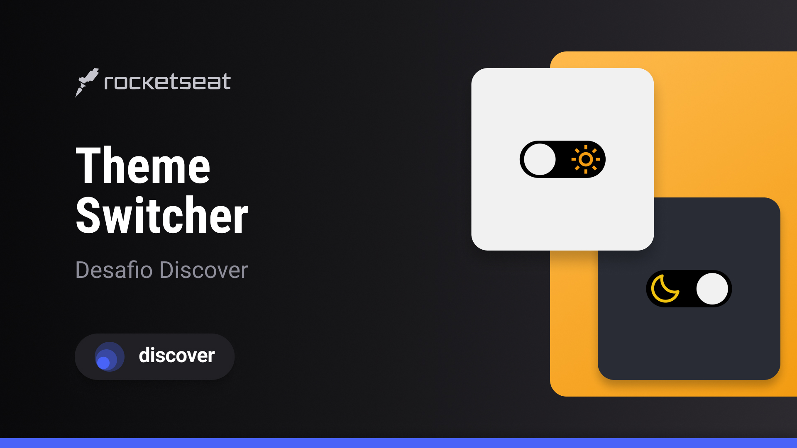

<h1 align="center"> Theme Switcher </h1>

Projeto feito por:  Matheus Gregorio

  <a href="#-tecnologias">Tecnologias</a>&nbsp;&nbsp;&nbsp;|&nbsp;&nbsp;&nbsp;
  <a href="#-projeto">Projeto</a>&nbsp;&nbsp;&nbsp;|&nbsp;&nbsp;&nbsp;
  <a href="#-layout">Página</a>&nbsp;&nbsp;&nbsp;|&nbsp;&nbsp;&nbsp;
  <a href="#memo-licença">Licença</a>

  

 

  

## 🚀 Tecnologias

Esse projeto foi desenvolvido com as seguintes tecnologias:

- HTML e CSS
- JavaScript
- Git e Github
- Figmar

## 💻 Projeto

Theme Switcher é um projeto simples mas que serve para treinar a habilidade de mudar a cor do site utilizando um switch

## 🔖 Visualizar página

Visualize o projeto através  [DESSE LINK](https://switchcolorsite.netlify.app/).

## :memo: Licença

Esse projeto está sob a licença MIT.

---